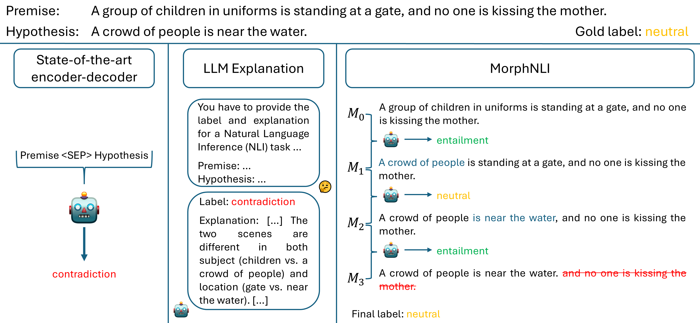
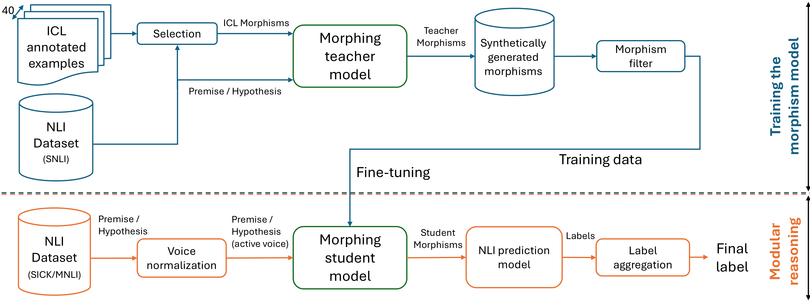

# MorphNLI: A Stepwise Approach to Natural Language Inference Using Text Morphing

> **Original paper accepted in Findings of the Association for Computational Linguistics: NAACL 2025**  
> [Read the paper here](https://arxiv.org/abs/2502.09567)

## Introduction

Natural Language Inference (NLI) determines whether a text hypothesis is true, false, or undetermined given a text premise. While crucial for tasks like question answering, summarization, and dialogue systems, large language models (LLMs) often suffer from contamination and overfitting to artifacts.

**MorphNLI** introduces a cautious and modular strategy: decomposing the decision process into simpler, explainable steps through **text morphing**. By incrementally morphing the premise into the hypothesis, our method improves interpretability and robustness, particularly for out-of-domain (OOD) scenarios.



## Approach

MorphNLI operates through three main stages:

1. **Incremental Morphing**  
   Gradually convert the premise into the hypothesis through a sequence of small, atomic edits called **morphisms**:
   - Replace - (replace, `old_text`, `new_text`)
   - Remove - (remove, `text`)
   - Insert - (insert, `text`)

2. **Local Inference**  
   An NLI classifier is applied to each transformation pair, generating a sequence of labels.

3. **Global Decision Aggregation**  
   The final NLI label is derived by combining local decisions:
   - If all intermediate labels are entailment → overall entailment.
   - Otherwise → **first non-entailment label**.

### Training the Morphism Model

One of our key contributions is training a morphism generation model with **minimal supervision**. The only supervision we require is:
- A dataset of premise/hypothesis pairs with associated NLI labels (SNLI)
- A small pool of sentence pairs annotated with morphisms ([`fine-tuning/ICL_all_examples.json`](fine-tuning/ICL_all_examples.json))
- Synthetic morphisms generated via an LLM with In-Context Learning (ICL), filtered for quality ([`fine-tuning/training_examples_filtered.json`](fine-tuning/training_examples_filtered.json))

The **student morphism model** is fine-tuned on this curated data, enabling it to infer morphisms during inference.

### Modular Reasoning Using Morphisms

Inference in MorphNLI consists of four steps:

1. **Voice Normalization (VN)**  
   Convert both premise and hypothesis into active voice to ease the morphing process.

2. **Morphing**  
   Generate morphisms using the fine-tuned student model.

3. **Individual NLI Decisions**  
   Apply an NLI model (RoBERTa or BART) to each morph pair.

4. **Aggregate Inference**  
   Combine intermediate labels into a final decision using the simple heuristic explained above.



## Experimental Results

Experiments were conducted on:
- **SICK** dataset
- **MNLI** dataset

Evaluation covered both:
- **In-Domain (ID)** scenarios - where the NLI engine was fine-tuned on the same dataset as the testing dataset
- **Out-of-Domain (OOD)** scenarios - where the NLI engine was fine-tuned on a different dataset rather than the testing dataset

The results are presented below:

| Model                    | SICK ID | SICK OOD |
|---------------------------|---------|----------|
| RoBERTa Vanilla           | 90.64   | 56.62    |
| RoBERTa Vanilla (+VN)     | **90.91**   | 56.52    |
| RoBERTa Morphism          | 88.14   | 57.68    |
| RoBERTa Morphism (+VN)    | 88.32   | **57.94**    |
| BART Vanilla              | 89.85   | 59.29    |
| BART Vanilla (+VN)        | **90.07**   | 58.64    |
| BART Morphism             | 87.38   | 59.64    |
| BART Morphism (+VN)       | 88.59   | **60.38**    |

| Model                    | MNLI ID | MNLI OOD |
|---------------------------|---------|----------|
| RoBERTa Vanilla           | **89.91**   | 53.00    |
| RoBERTa Vanilla (+VN)     | 88.50   | 52.77    |
| RoBERTa Morphism          | 85.01   | **58.29**    |
| RoBERTa Morphism (+VN)    | 83.32   | 56.73    |
| BART Vanilla              | **88.24**   | 46.86    |
| BART Vanilla (+VN)        | 86.48   | 45.50    |
| BART Morphism             | 82.00   | **52.78**    |
| BART Morphism (+VN)       | 80.16   | 51.12    |

The generated morphisms and predicted labels, for both SICK and MNLI (dev and test) are present in [`inference_results/`](inference_results/).

MorphNLI consistently outperforms vanilla NLI models in OOD settings, confirming that modular inference enhances generalization and domain transfer. Notable performance improvements include:
- +1.74% on SICK (BART with VN)
- +5.92% on MNLI (BART without VN)

Although there is a slight performance drop in ID settings, the method’s robustness and explainability gains are significant.

## Conclusion

MorphNLI introduces a novel modular, explainable approach to NLI by framing it as a sequence of small, interpretable transformations. Our findings demonstrate:
- Better OOD performance across datasets and models
- Greater explainability through visible morphing steps and local NLI decisions

This modular step-by-step reasoning could serve as a blueprint for more resilient NLI systems.


## Citation

If you use MorphNLI, please cite:

```bibtex
@misc{negru2025morphnli,
      title={MorphNLI: A Stepwise Approach to Natural Language Inference Using Text Morphing}, 
      author={Vlad-Andrei Negru and Robert Vacareanu and Camelia Lemnaru and Mihai Surdeanu and Rodica Potolea},
      year={2025},
      eprint={2502.09567},
      archivePrefix={arXiv},
      primaryClass={cs.CL}
}
```
## Authors

- [Vlad-Andrei Negru](https://scholar.google.com/citations?user=uOSGq8wAAAAJ&hl=ro)
- [Robert Vacareanu](https://scholar.google.com/citations?user=pq9Fo2IAAAAJ&hl=ro)
- [Camelia Lemnaru](https://scholar.google.com/citations?user=GGOS0SAAAAAJ&hl=ro)
- [Mihai Surdeanu](https://scholar.google.com/citations?user=a3133-8AAAAJ&hl=ro)
- [Rodica Potolea](https://scholar.google.com/citations?user=qGcUwiUAAAAJ&hl=ro)
